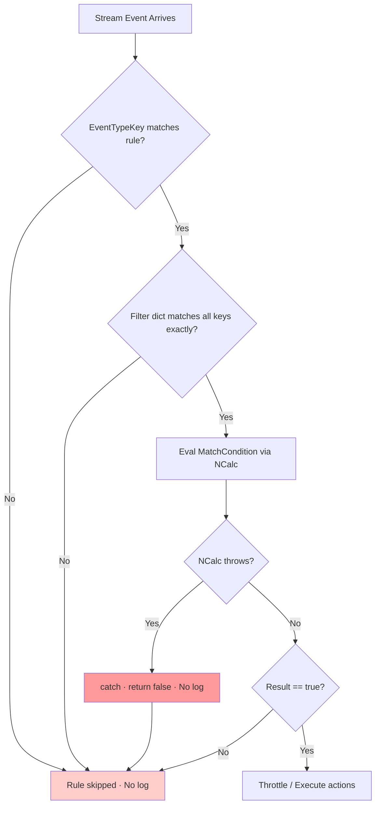
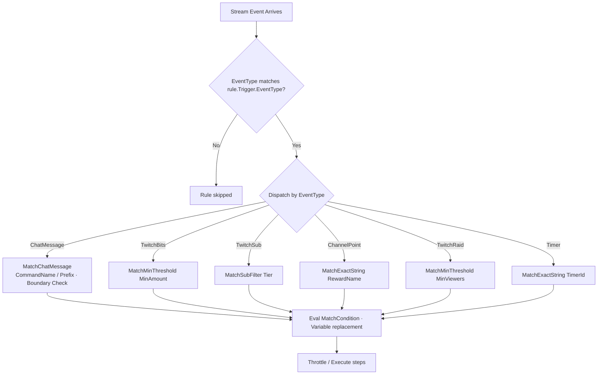
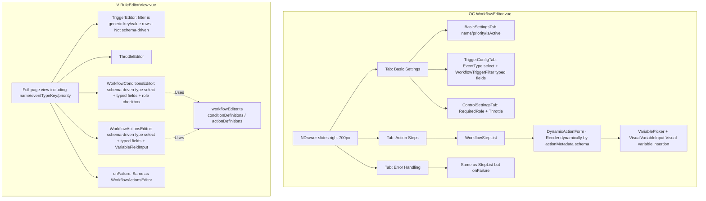

# Workflow Rule Design Comparison & Migration Plan

> **Status**: Draft · **Author**: Codex · **Created Date**: 2026-05-27
>
> **Baseline for Comparison**: `ref/Omni-Commander` (OC) vs. current `src/Vulperonex.*` (V) state
>
> **Motivation**: The member overlay showed no response when entering `!checkin` in Twitch chat. The root cause was identified as the lack of typed semantics in the current trigger filter design, which led to an accidental configuration of `platform=simulation`, locking up the production platform. Furthermore, when NCalc evaluation fails, it silently falls back to `false` without any warning across the entire pipeline. This document compiles the design differences between the two systems and proposes a phased migration plan.

---

## 1. Background: Today's Incident

In the database, there was an existing boot-seeded Phase 7 sample rule: trigger is `user.message`, `MatchCondition` compares with `!checkin`, and **the filter was mistakenly set to `platform=simulation`**. The actions included `triggerCheckIn` and `sendChatMessage`. The issue was that the filter locked the rule to the simulation platform.

The chain of issues:

1. A real Twitch chat event arrived with `platform=twitch`. The generic filter dispatch ([WorkflowEngine.cs:242 `MatchesTriggerFilter`](../../src/Vulperonex.Application/Workflows/WorkflowEngine.cs)) required all keys/values in the dictionary to match exactly → `simulation != twitch` → the rule was silently skipped.
2. Operators had no way of knowing from the UI/logs why the rule was not triggered. In the database, the filter key `platform` was conflated with Vulperonex domain semantics (where events and filters should align with the "event payload dimensions").
3. The NCalc evaluator ([NCalcExpressionEvaluator.cs:36](../../src/Vulperonex.Infrastructure/Expressions/NCalcExpressionEvaluator.cs)) has three silent fallback paths: `null/whitespace` ([:13](../../src/Vulperonex.Infrastructure/Expressions/NCalcExpressionEvaluator.cs)), `HasErrors()` ([:29](../../src/Vulperonex.Infrastructure/Expressions/NCalcExpressionEvaluator.cs)), and `catch { return false; }` ([:36](../../src/Vulperonex.Infrastructure/Expressions/NCalcExpressionEvaluator.cs)). All of them return `false` without logging, making any syntax or logical error in `MatchCondition` completely silent.

> **Note (2026-05-28)**: Commit `b063d1a feat(web): seed default !checkin chat rule on first boot` has **parallelly** added a default `!checkin` rule without the faulty filter (which is seeded by `DefaultWorkflowRuleSeedService` only when there are no `triggerCheckIn` rules in the DB).
>
> **Development Stage Decision (2026-05-28)**: Vulperonex has not been released yet, and there is no real operator data. For Phase B, we will **directly wipe existing workflow rules and reseed typed examples**, rather than utilizing the audit path of `legacy_filter_blob` (reverting the previous AD-5). This document focuses on a **systemic** fix (typed dispatch + failure observability + template reconstruction) rather than a hotfix for that single bug.

In comparison, OC's `TriggerMatcher.cs` performs a typed switch dispatch based on `EventType`. For instance, `ChatMessage` automatically handles command boundaries (preventing `!so` from matching `!sorry`), `TwitchSub` has dedicated fields like `Tier`, and `TwitchBits` provides threshold comparisons like `MinAmount`. Filter keys are not freely typed by users; they are fixed slots defined by the engine for each event type.

---

## 2. Domain Schema Comparison

| Dimension | OC (ref) | V (Current) | Evaluation |
|---|---|---|---|
| Event Type | `enum TriggerEventType` (9 typed events) | `string EventTypeKey` (open) | OC guarantees type safety at compile time; V allows extension without modifying enums. |
| Trigger Structure | `WorkflowTrigger { EventType, Filter, MatchCondition }` | `WorkflowTrigger { EventTypeKey, Filter, MatchCondition }` | Identical |
| Filter Semantics | Per-event-type typed semantics (`CommandName`/`Prefix`/`MinViewers`/`Tier`/`RewardName`) | Generic `Dict<string,string>` matching all keys | **OC Wins**; V is prone to misuse. |
| Action Model | `WorkflowStep { ActionName: string, Parameters: Dict<string,string> }` | `WorkflowAction` abstraction + `[JsonPolymorphic]` strongly typed records (15 types, [Actions/](../../src/Vulperonex.Application/Workflows/Actions/)) | **V Wins**; type-safe + IDE auto-completion. |
| Sub-workflow | Implicit via `Trigger == null` | Explicit via `IsSubWorkflow: bool` + `InvokeSubWorkflowAction` | V is clearer. |
| Throttle | `ThrottlePolicy` | `WorkflowThrottlePolicy` | Consistent |
| Permissions | `RequiredRole` (CommandRoleLevel) + `RequiredCustomRoles` as first-class citizens | None (must be embedded in `Conditions[]` or `MatchCondition`) | **OC Wins** |
| Conditions | No independent layer (relies entirely on `MatchCondition`) | `Conditions[]` + `MatchCondition` (Dual layers) | V's multiple layers might be redundant. |
| Execution Mode | Fixed sequential execution | `Serial` / `Parallel` + `MaxParallelism` | V is more feature-rich. |
| Expression Engine | Custom ExpressionEvaluator (simple variable replacement) | NCalc full expression engine | V offers stronger expressiveness; OC is simpler and more predictable. |
| Variable Namespace | `Trigger.*` / `Step.*` / `Args.*` | + `Member.*` / `Failure.*` | V offers more namespaces. |

---

## 3. Trigger Matching Flowchart

### 3.1 V's Current State (Generic Dispatch)

**Silent Failure Points**: B, C, E, and F all fail without emitting logs. Today's incident occurred at step C (the filter `platform=simulation` rejected the Twitch event).

### 3.2 OC (Typed Dispatch)

**Difference**: The semantics of each event type's filter are determined by the engine, preventing users from filling in invalid filters. `MatchChatMessage` automatically enforces boundary checks to prevent `!so` from matching `!sorry`, which serves as a safety net currently missing in V.

---

## 4. UI/UX Comparison

### 4.1 Technology Stack

| | OC | V |
|---|---|---|
| Framework | Vue 3 + Naive UI + Tailwind + Vite + **Tauri** | Vue 3 + Custom CSS + Vite |
| Component Library | Naive UI (Full design system) | Custom components |

### 4.2 Editor Structure

**V has implemented a schema-driven visual editor**, including type selection dropdowns, strongly typed field rendering (supporting text, number, textarea, checkbox, select, string-list, number-list), a role permissions checkbox UI, as well as `VariablePicker` and `VariableFieldInput` for variable insertion. `actionsText` and `conditionsText` only serve as serialized transmission strings between parent and child components, rather than the actual interface edited by the user.

| Dimension | OC | V | Evaluation |
|---|---|---|---|
| Container | Drawer (does not leave the list) | Full-page view (loses context on page switch) | OC is smoother. |
| Layout | Tabs (Basic/Actions/Failures) | Vertically long form | OC layout is clearer. |
| Trigger Filter | Dynamically switches typed fields by event type | Generic key/value blank inputs | **OC Wins** (This is V's only non-schema-driven section). |
| Action Editing | Schema-driven `DynamicActionForm` | Schema-driven `WorkflowActionsEditor` | **Tie** |
| Condition Editing | (Via `WorkflowStepList`) | Schema-driven `WorkflowConditionsEditor` + role checkboxes | **Tie** |
| Variable Insertion | `VariablePicker` + `VisualVariableInput` (OC node view) | `VariablePicker` + `VariableFieldInput` (V, cursor-aware insertion) | **Tie** |
| Metadata Source | Backend `TriggerMetadataProvider` / Action metadata (Single source of truth) | Hardcoded in frontend `workflowEditor.ts` | **OC Wins** — V runs the risk of schema drifts between FE and BE. |
| Validation Errors | Parsed from backend `WorkflowValidationResult.errors[].code/message` for structured display | String details | OC is more granular. |

### 4.3 Metadata-Driven Design

OC's backend provides a `TriggerMetadataProvider` offering:
- `GetAvailableTriggers()`: List of selectable event types.
- `GetValidVariables()`: A whitelist of valid `{Trigger.*}` variables for each event type (e.g., `ChatMessage` has `CommandName`/`RawMessage`/`UserLogin`/...).

The frontend store pulls metadata from the backend, which drives UI rendering:
- The Trigger dropdown only lists valid event types.
- The Filter fields switch to a typed schema based on the event type.
- `VariablePicker` only lists variables valid for the current event type.
- The Action form is rendered dynamically by pulling parameter schemas via `getActionMetadata(actionName)`.

**V's Current State**:
- Action/Condition metadata already exists but is **hardcoded in the frontend** `workflowEditor.ts` (`actionDefinitions` / `conditionDefinitions`).
- The Trigger filter is still generic key/value and **not schema-driven**.
- The backend `WorkflowRuleValidator` already does partial validation (e.g., checking if the event type is known) but does not expose metadata to the frontend.

**Core Gap Analysis**:
- **Trigger filter is not schema-driven**: V's main bottleneck.
- **Metadata double-maintenance risk in FE/BE**: Adding an action requires modifying both FE TypeScript and the BE record, leaving no single source of truth.
- **Variable whitelist is not restricted per-event-type**: `VariablePicker` lists all variables instead of filtering them based on the current trigger.

---

## 5. Objective Summary

### Vulperonex Merits (to be retained):
1. **Schema-driven Editor UI**: Strongly typed `WorkflowConditionsEditor`/`WorkflowActionsEditor`/`VariableFieldInput` are already implemented.
2. **Strongly Typed Action Design**: Utilizing polymorphic records (`[JsonPolymorphic]`) to guarantee runtime type safety.
3. **NCalc Expression Engine**: Supports arbitrary boolean evaluations, offering high expressiveness.
4. **Explicit Design**: Clear and explicit declarations of `IsSubWorkflow` and `Parallel` execution modes.
5. **Event Extensibility**: `EventTypeKey` is designed as an open string, allowing new events to be added without modifying backend enums.
6. **Role Filtering**: Equipped with a strongly typed `UserRoleCondition` and a frontend role-selection UI.

### Lessons and Improvements from Omni-Commander:
1. **Strongly Typed Trigger Filter Semantics (Per Event Type)**: Refactor generic dictionary exact-matching to eliminate silent skips caused by misconfigured platform fields.
2. **Backend Metadata Provider as Single Source of Truth**: Replace the hardcoded definitions in `workflowEditor.ts` to drive frontend filter schemas and dynamic variable whitelists.
3. **Drawer + Tabs Container UX**: Enhance V's current full-page form layout to prevent losing context when switching pages.
4. **NCalc Evaluation Warning Logs**: Replace the behavior of swallowing exceptions in NCalc catches with `LogWarning`, injecting rule identifiers to streamline troubleshooting.

---

## 5b. V's Internal Schema Conflicts (Unrelated to OC Comparison)

Cross-file static analysis reveals the following inherent conflicts in V's existing design that must be resolved prior to borrowing features from the cross-platform counterpart. Otherwise, when the Phase B metadata UI goes live, these conflicts will scale up into severe UX bugs.

### 5b.1 Duplicate Definition of `EventTypeKey`

- **Outer**: [`WorkflowRule.EventTypeKey`](../../src/Vulperonex.Application/Workflows/WorkflowRule.cs) (`required string`)
- **Inner**: [`WorkflowTrigger.EventTypeKey`](../../src/Vulperonex.Application/Workflows/WorkflowTrigger.cs)
- **Routing**: [`WorkflowEngine.ProcessEventAsync`](../../src/Vulperonex.Application/Workflows/WorkflowEngine.cs) uses the outer field.

**Existing Safeguards** (correcting previous assessment):
- **API Entry**: [`WorkflowRuleValidator.cs:54`](../../src/Hosts/Vulperonex.Web/Validation/WorkflowRuleValidator.cs) rejects upserts with mismatched outer/inner `EventTypeKey`.
- **JSON Deserialization**: [`WorkflowRuleJsonMapper.NormalizeTrigger`](../../src/Hosts/Vulperonex.Web/Workflows/WorkflowRuleJsonMapper.cs) forces the inner field to equal the outer field.

**Residual Risks**: Although API/UI paths are secured, the following entry points may still write redundant or outdated data:
- Direct DB `INSERT` / `UPDATE` (migration scripts, manual patching).
- CLI or plugin invocations calling `IWorkflowRuleRepository` directly, bypassing the Web validator.
- Historical rules written before the validator safeguards were fully implemented.

The root of this issue is **structural redundancy**: both fields are artificially kept in sync, requiring double writes in the frontend. Any new entry point must remember to implement this sync.

**Action**: Abolish `WorkflowTrigger.EventTypeKey` and treat the outer field as the single source of truth. Phase A.5 focuses on **schema simplification + legacy row migration** (not patching validator gaps). The frontend editor will drop double writes, and CLI/plugin implementations will instantly benefit by having one less field to maintain.

### 5b.2 Duplicate Definition of `MatchCondition` + Fallback Priority

- **Outer**: `WorkflowRule.MatchCondition`
- **Inner**: `WorkflowTrigger.MatchCondition`
- **Engine**: `var matchCondition = rule.MatchCondition ?? trigger?.MatchCondition;`

**Issue**: Ambiguous semantics (behavioral differences between empty string vs. null); required two-way synchronization in the frontend; and since `WorkflowRule.Conditions[]` is already an independent layer, having two more `MatchCondition` fields results in a total of three layers of logical gates, which makes it hard for operators to reason about.

**Action**: Retain the outer `WorkflowRule.MatchCondition` + `Conditions[]` and abolish `WorkflowTrigger.MatchCondition`. `MatchCondition` acts as a "rule-level guard spanning across triggers," independent of trigger structures, making the outer level its correct home.

### 5b.3 Conflict Between `IsSubWorkflow == true` and `required EventTypeKey`

- `WorkflowRule.EventTypeKey` is marked as `required string`.
- When `WorkflowRule.IsSubWorkflow == true`, the engine bypasses event routing.
- The frontend `isSubWorkflow=true` hides `TriggerEditor`, sending `eventTypeKey=""` upon submission.
- Using an empty string to bypass a `required` modifier contradicts the principles of strong typing.

**Issue**: Once Phase B metadata validation goes live (where `eventTypeKey` must belong to a valid registry list), empty strings will be rejected.

**Current Reality**: `WorkflowRuleValidator` lacks any conditional branches for `IsSubWorkflow`. The null/whitespace short-circuit mentioned in §5b.6 also applies to sub-workflow upserts, meaning that creating sub-workflow rules via the API is **currently broken** (returning 400 `UNKNOWN_EVENT_TYPE_KEY`).

**Existing Write Paths**: [`DefaultWorkflowRuleSeedService`](../../src/Hosts/Vulperonex.Web/DefaultWorkflowRuleSeedService.cs) writes directly using `IWorkflowRuleRepository`, bypassing the validator (which is reasonable since seeds fall within an internal trust boundary). Web API paths cannot currently create sub-workflow rules, a limitation that must be resolved in Phase A.5 by introducing an `IsSubWorkflow` branch to the validator.

**Action**: Change `WorkflowRule.EventTypeKey` to `string?`.
- **Validator**: When `IsSubWorkflow == true`, require `EventTypeKey is null && Trigger is null`. When `IsSubWorkflow == false`, require it to be non-empty and present in the valid metadata list.
- **DB Migration**: Convert `eventTypeKey=""` of existing sub-workflow rules to `NULL`.

### 5b.4 Missing RuleId/RuleName in `ExpressionContext` — Untraceable Logs

[`ExpressionContext`](../../src/Vulperonex.Application/Expressions/ExpressionContext.cs) only contains `Trigger`, `Steps`, `Args`, `Member`, and `Failure`. When the NCalc evaluator catches and swallows exceptions, it only knows the expression string, without knowing which rule it belongs to. Consequently, the Phase A objective of letting operators view failure causes is compromised.

**Action**: Choose one of two paths:
- (a) Add `RuleId` and `RuleName` properties to `ExpressionContext` and populate them upon instantiation.
- (b) Modify the signature of `IExpressionEvaluator.Evaluate` to include an `EvaluationCallSite { RuleId, RuleName, Stage }` parameter.

Path (a) has the smallest impact but litters the context; Path (b) is cleaner but introduces breaking API changes. We favor (a) since the context is inherently designed to carry "all state visible to the evaluator."

### 5b.5 `workflow.timer` Not Registered in Event Type Registry — Missing in UI and Validator

[`StreamEventKeys.cs`](../../src/Vulperonex.Domain/Events/StreamEventKeys.cs) defines `WorkflowTimer = "workflow.timer"`, and [`WorkflowTimerHostedService`](../../src/Vulperonex.Application/Workflows/Timers/WorkflowTimerHostedService.cs) fires `WorkflowSystemEvent` using this key. However:
- **The actual source of the UI dropdown** is `/api/event-types` ([`EventTypeEndpoints.cs`](../../src/Hosts/Vulperonex.Web/Endpoints/EventTypeEndpoints.cs)) → `IStreamEventTypeRegistry.GetAll()`, which returns metadata registered in [`InMemoryStreamEventTypeRegistry`](../../src/Vulperonex.Infrastructure/EventTypes/InMemoryStreamEventTypeRegistry.cs).
- Currently, the registry only registers supported events inside adapter `StartAsync` methods. Neither `TwitchAdapter.cs:21-31` nor the simulation adapter registers `workflow.timer` (which makes sense since the timer is an engine-internal event rather than adapter-sourced).
- **Result**: Operators cannot see the timer option in the UI, and even if they manually `POST /api/rules` with `eventTypeKey="workflow.timer"`, `IsKnownForWorkflow("workflow.timer")` inside [`WorkflowRuleValidator.cs:24`](../../src/Hosts/Vulperonex.Web/Validation/WorkflowRuleValidator.cs) returns false, resulting in a 400 response.

*Note*: [`StreamEventDescriptions.cs`](../../src/Vulperonex.Domain/Events/StreamEventDescriptions.cs) is also missing the `WorkflowTimer` entry, but this class is never called in `src/` (used only for tests). **Fixing it alone will not solve the UI/validator issue.** Previous assessments mistakenly treated this as a single-point fix, whereas the actual fix requires adjusting the registry bootstrapping.

**Action**: Register `workflow.timer` during engine-internal event bootstrapping. Choose one of two landing spots:
- (a) Introduce a `WorkflowInternalEventTypeBootstrapper` one-shot `IHostedService` that registers engine-emitted keys into the registry during `StartAsync` (symmetrical to the adapter approach).
  - *Pros*: Clean architecture. Future engine-internal events can be added in the same place.
- (b) Override `WorkflowTimerHostedService.StartAsync` to perform the registration before starting.
  - *Pros*: Minimal changes. *Cons*: Mixed responsibilities (loop service acting as a registrar).

**Resolution: Adopt (a)** (backed by the second round of review). Synchronously add the entry to `StreamEventDescriptions` to keep the descriptions table consistent, but do not treat this alone as the "fix" to avoid misleading others. Future engine-internal events (e.g., system alerts, state changes) will all be housed in this bootstrapper.

**Acceptance**:
- `curl /api/event-types` response contains `{ "key": "workflow.timer", "description": "...", "isSimulatable": false }`.
- `POST /api/rules` with `eventTypeKey="workflow.timer"` no longer returns `UnknownEventTypeKey`.
- The timer option appears in the UI dropdown.
- Existing direct timer invocations (`InvokeAsync`) operate unchanged.

### 5b.6 `WorkflowRuleValidator` Throws 500 Instead of 400 for `EventTypeKey=null` (Fixed)

[`WorkflowRuleValidator.cs:28`](../../src/Hosts/Vulperonex.Web/Validation/WorkflowRuleValidator.cs) originally called `eventTypeRegistry.IsKnownForWorkflow(request.EventTypeKey)` directly. However, even though `EventTypeKey` in [`WorkflowRuleUpsertRequest`](../../src/Hosts/Vulperonex.Web/Workflows/WorkflowRuleDto.cs) is declared as `string` (C# nullable annotations are not enforced at runtime), the JSON deserializer could still populate it with null (or omit the field).

The call chain was:
- `IsKnownForWorkflow(null)` →
- `_metadataByKey.TryGetValue(null, ...)` in [`InMemoryStreamEventTypeRegistry`](../../src/Vulperonex.Infrastructure/EventTypes/InMemoryStreamEventTypeRegistry.cs) →
- `ArgumentNullException` →
- HTTP 500 (breaking API contracts; it should be 400 + `UNKNOWN_EVENT_TYPE_KEY`).

**Action** (Fixed in the current commit):
- Added a short-circuit check for `string.IsNullOrWhiteSpace(request.EventTypeKey)` at the entrance of `Validate`.
- Added the integration test `Given_WorkflowRuleCreate_When_EventTypeKeyIsNull_Then_Returns400WithUnknownEventTypeKey` to prevent regressions.

*Note*: After the sub-workflow `EventTypeKey: string?` design in §5b.3 goes live, nullability will become valid. At that point, this short-circuit check will be adjusted to reject only when "not a sub-workflow and EventTypeKey is null/whitespace."

---

## 6. Migration Plan (Phased Breakdown)

### Phase A: Immediate Stop-Bleeding (No Schema Changes)

**Goal**: Make today's bug visible. Operators should be able to see the cause of failures and trace them to a specific rule (resolving §5b.4).

**Log Noise Principles** (since every rule fans out for every matching event type, no-match is a standard path in chat flows and must not flood files with warnings):

| Event | Log Level | Reason |
|---|---|---|
| Expression parse / eval throw | `Warning` | Misconfiguration, low frequency, requires operator attention. |
| Filter key not in valid metadata list | `Warning` | Misconfiguration, requires operator attention. |
| Action executor throw | `Warning` | Real runtime failure. |
| Filter key in list but value mismatches (normal no-match) | `Debug` | High-frequency normal path. |
| `MatchCondition` evaluates to false (normal no-match) | `Debug` | High-frequency normal path. |
| Throttle deny | `Debug` | High-frequency normal path (per-user cooldown). |
| `EventTypeKey` mismatches (rule disregards event) | (No Log) | Normal fan-out. |

**PII / Sensitive Data**: Logs must not output the full expression body and filter value strings. Instead, log `RuleId` + `ExpressionHash` (first 8 chars of SHA1) + classification code. During debugging, operators can query the original expression in the DB using the `RuleId`.

**Tasks**:
- [ ] Add `RuleId` / `RuleName` properties to `ExpressionContext` (resolving §5b.4).
- [ ] Inject current rule data in `WorkflowEngine.BuildExpressionContext`.
- [ ] Inject `ILogger` into `NCalcExpressionEvaluator`.
  - On eval throw / `HasErrors` → log `LogWarning` containing `{RuleId} {RuleName} {ExpressionHash} {ErrorClass}`.
- [ ] Inject `ILogger` into `WorkflowEngine`, classifying logs based on the table above.
  - Introduce structured event logging (`workflow_rule_skipped` + classification fields) so operators can aggregate via queries instead of relying on free-text grepping.
- [ ] `MatchesTriggerFilter`: log `Warning` for unknown keys; log `Debug` for value mismatches.
- [ ] Add a short table of "known valid filter keys" in documentation (maintained manually, to be replaced in Phase B).

**Acceptance**:
- For a rule with an intentional typo, restarting Web → triggering event → `Warning` shows `RuleId={...} ExpressionHash=... ErrorClass=...` for instant troubleshooting.
- Under normal chat traffic, the `Information` log level shows no no-match noise; switching to `Debug` reveals the complete fan-out traces.
- Logs contain no raw expression texts (preventing PII/secret leaks).

---

### Phase A.5: Schema Cleanup (§5b.1 / §5b.2 / §5b.3, AD-3 in Same Release)

**Goal**: Eliminate V's internal schema redundancies and contradictions, paving the way for Phase B metadata.

- [ ] **§5b.1**: Abolish `WorkflowTrigger.EventTypeKey`.
  - Remove the property from the Domain model (but keep the `JsonConstructor` accepting the old field for deserialization to avoid breaking existing DB rows).
  - DB Migration: Scan `workflow_rules.trigger_json` and lift the inner `eventTypeKey` to the outer layer (if they mismatch, prioritize the outer level and emit a warning log).
  - Frontend `RuleEditorView`: Remove double writes; make the trigger editor read only the outer level.
- [ ] **§5b.2**: Abolish `WorkflowTrigger.MatchCondition`.
  - Remove the property from the Domain model.
  - DB Migration: If the inner level has a value while the outer is null, lift it to the outer layer. If both have values, prioritize the outer layer and emit a warning log.
  - `WorkflowEngine.MatchesTrigger`: Remove the fallback, reading only `rule.MatchCondition`.
- [ ] **§5b.3**: Change `WorkflowRule.EventTypeKey` to `string?` (strict ordering: BE first, FE second).
  - [1] Validator (`WorkflowRuleValidator`):
    - `IsSubWorkflow == true` ⇒ `EventTypeKey is null && Trigger is null`.
    - `IsSubWorkflow == false` ⇒ `EventTypeKey is not null and not whitespace`.
  - [2] DB Migration: Set `event_type_key = NULL` for sub-workflow rules.
    - **Pre-check**: Ensure EF Core entity mappings and column constraints are adjusted in sync.
    - **Lock Risk**: Run `EXPLAIN` (or SQLite `EXPLAIN QUERY PLAN`) in staging to evaluate data volume. If altering the column to allow NULL is required, split it into two migrations (drop NOT NULL first, then backfill in a later release) to avoid long table locks.
  - [3] Frontend (after [1] is live): Omit `eventTypeKey` in payloads when in sub-workflow mode.

**Acceptance**:
- `EventTypeKey` appears exactly once in the schema.
- `MatchCondition` appears exactly once in the schema (side by side with `Conditions[]`).
- Creating sub-workflow rules no longer requires a trigger, and the validator passes successfully.
- Existing rules round-trip normally (read → edit → save) without losing fields.

---

### Phase B: Metadata Service Layer + Legacy Scrub

**Goal**: Introduce a single source of truth in the backend to tell the frontend "what filter fields, variables, and action parameters are valid for each event type."

**Development Stage Policy (replacing the old legacy_filter_blob design)**:
V has not been released yet, and there is no real operator data → follow the simplest path:

| Path | Policy |
|---|---|
| **Creating/Editing Rules** | **Strict** — Directly return 400 for filter keys not in the valid metadata list. |
| **Reading Existing Rules** | **Strict** — No lenient paths allowed, since the DB has been wiped. |
| **Engine Runtime Routing** | Only evaluate `Trigger.Filter` (typed matchers will be introduced in Phase C). |
| **DB Migration (Phase B shipping)** | Run `DELETE FROM workflow_rules` to clear all data (safe in the dev stage), and let `DefaultWorkflowRuleSeedService` reseed a set of typed sample rules to establish the new baseline. |

**Tasks**:
- [ ] Add `ITriggerMetadataProvider` (matching OC), returning:
  - `AvailableEventTypes`: `[{ key, displayName, description }]`
  - `FilterFieldsFor(eventTypeKey)`: `[{ key, label, type: text/number/select, options?, help, required? }]`
  - `ValidVariablesFor(eventTypeKey)`: `string[]`
- [ ] Add `IActionMetadataProvider`: each action declares:
  - `parameters: [{ key, displayName, type, isRequired, description, defaultValue }]` (defined using attributes on the action record or builder patterns).
- [ ] Add endpoints `GET /api/metadata/triggers` and `GET /api/metadata/actions`.
- [ ] Add endpoint `GET /api/rules?withMigrationWarnings=true` to let the UI flag pending rules.
- [ ] `WorkflowRuleValidator`: enforce strict validation on creation/editing paths; lenient validation on reading paths.
- [ ] DB Migration: Move legacy filter keys to `legacy_filter_blob` and flag them.
- [ ] Unit Tests: Verify that every existing `EventTypeKey` has a corresponding entry in the metadata; check that the strict validator returns 400 for filter keys missing from metadata; verify that lenient reading is preserved and returns `migrationWarnings`.

**Acceptance**:
- Invalid filter keys cannot be written to new rules (API returns 400).
- Existing non-compliant rules remain readable, returning `migrationWarnings: ["filter.platform is deprecated"]` in the response.
- The frontend list displays a warning chip on non-compliant rules, forcing operators to resolve the issue in the editor before saving.
- Replaced the assertion "all existing rules pass the strict validator" with "all rules round-trip successfully + non-compliant rules carry warnings."

---

### Phase C: Filter Typed Dispatch (Backend)

**Goal**: Replace generic dictionary matching with an OC-style per-event-type matcher.

**Prerequisites**: Phase A.5 (schema cleanup) + Phase B (metadata + legacy migration) are completed. Legacy migration has already moved non-compliant filter keys to `legacy_filter_blob` (per the Phase B policy table).

- [ ] Add `TriggerFilterMatcherRegistry` to register matchers by `EventTypeKey`.
- [ ] Built-in Matchers (aligning event keys with [`StreamEventKeys.cs`](../../src/Vulperonex.Domain/Events/StreamEventKeys.cs)):
  - `user.message` → `MatchChatMessage` (CommandName / Prefix + boundary checks).
  - `user.donated` → `MatchMinThreshold(MinAmount)`.
  - `user.subscribed` → `MatchSubFilter(Tier)`.
  - `user.gifted_sub` → `MatchSubFilter(Tier) + MatchMinThreshold(MinGiftCount)`.
  - `channel.raided` --> `MatchMinThreshold(MinViewers)`.
  - `reward.redeemed` → `MatchExactString(RewardName)`.
  - `workflow.timer` → `MatchExactString(TimerId)`.
  - Others → fallback to generic dict + emit warning log (for backward compatibility).
- [ ] Modify `WorkflowEngine.MatchesTrigger` to invoke the matcher registry.
- [ ] **`legacy_filter_blob` does not participate in the matcher registry** (the Phase B policy forces it to be UI/audit only). The engine-visible `Trigger.Filter` is already scrubbed by migration.
- [ ] Add Unit / Integration Tests: verify `!so` does not match `!sorry`, and `MinAmount: 100` does not match `Bits=50`.
- [ ] Integration Test: verify that the §1 sample rule (with `platform=simulation` moved to `legacy_filter_blob` after Phase B migration) triggers successfully on a Twitch chat `!checkin` (end-to-end).

**Acceptance**:
- **§1 Original Rule** (manually created under the boot-seed ID with `filter.platform=simulation`) triggers `triggerCheckIn` from Twitch chat `!checkin` after Phase B migration (end-to-end) — ruling out false-positives introduced by parallel default rules.
- Existing non-compliant rules continue to display warning chips in the UI until the operator manually cleans up `legacy_filter_blob`. Runtime execution is unaffected by the blob contents.
- *Note*: This phase does not mandate that the operator manually delete `filter.platform=simulation`. The Phase B migration isolates the field from the runtime filter to the blob, leaving the UI to guide subsequent cleanup.

---

### Phase D: WebUI UX Enhancement (Post-Gate)

#### Gate D: Pre-execution Checklist
- [x] **AQ-1 Resolved**: Adopt Reka UI (headless) + existing custom CSS (AD-6).
- [ ] **Reka UI PoC**: Run `pnpm add reka-ui` and build a minimal working example of a Drawer, Tabs, and Form.
  - Measure bundle size (before/after gzip, target +<200 KB, estimate ~30 KB).
  - **Design Tokens Integration Verification**: Verify that Reka primitive unstyled slots / data-attributes (`data-state`, `data-orientation`, etc.) can be hooked by existing CSS variable selectors, ensuring theme colors (dark/light, accent colors) are inherited completely without rewriting the token system.
  - List styling integration samples for at least 3 critical components (Drawer / Tabs / Dialog).
- [ ] Log PoC results in ADR `docs/zh-TW/adr/[N]-phase-d-ui-container-library.md`.
- [ ] If PoC bundle size exceeds limits → Fall back to Naive UI tree-shake → If still exceeding, hand-craft the components.
- [ ] If PoC token integration friction exceeds expectations → Evaluate Inspira UI styled recipes as a baseline.
- [ ] Phase B endpoints are live (D depends on B).

**Tasks**:
- [ ] Introduce Drawer and Tabs components (library decided by the gate).
- [ ] Create `RuleEditorDrawer.vue` to replace `RuleEditorView.vue`.
  - Three tabs: Basic / Action Steps (embedding existing `WorkflowActionsEditor`) / Error Handling (embedding existing `onFailure` editor).
- [ ] Upgrade `TriggerEditor` to be schema-driven: pull `FilterFieldsFor(eventTypeKey)` from `/api/metadata/triggers` to render typed fields dynamically (replacing generic key/value rows).
- [ ] Upgrade `VariablePicker` to filter by `eventTypeKey`, pulling `ValidVariablesFor(eventTypeKey)` from metadata.
- [ ] Modify `actionDefinitions` / `conditionDefinitions` in `workflowEditor.ts` to pull from `/api/metadata/actions` on startup, retaining a minimal hardcoded fallback to prevent empty displays during API failures.
- [ ] Retain `RuleEditorView` as the "Advanced JSON Mode" fallback.
- [ ] Phased Migration: Add an "Edit (New)" button to the list, retaining the old edit button.

**Acceptance**:
- Streamers can create the §1 sample rule in the new Drawer without writing JSON.
- `TriggerEditor` displays `CommandName` and `Prefix` typed inputs under `user.message`.
- `VariablePicker` only lists variables valid for the current event under `user.message`.
- Adding a new action only requires modifying the BE record + metadata attribute; the FE pulls it automatically without any changes.

---

### Phase E: Role Gating UX Enhancement (Parallelizable with Phase D)

**Core Mission** (Leveraging V's existing strongly typed `UserRoleCondition` to avoid top-level redundant filtering):
- Leverage the existing Condition execution path, focusing on enhancing editor UX usability.

**Tasks**:
- [ ] Add a "Common Role Restrictions" shortcut to the editor's Basic tab (which directly pushes a `userRole` Condition to `Conditions[]` behind the scenes, eliminating the need to add it manually).
- [ ] Pins the `userRole` Condition to the very top of the Conditions tab UI (since it is the most common).
- [ ] Migration Prompts: Scan existing rules with `Member.IsModerator` / `Member.IsSubscriber` NCalc expressions and display a "Can be converted to UserRoleCondition" chip (no auto-conversion).
- [ ] Add a short documentation mapping NCalc role expressions to `UserRoleCondition` configurations.

**Non-Goals**:
- Do not add `RequiredRole` or `RequiredCustomRoles` fields to the top-level `WorkflowRule`.
- Do not modify the schema or behavior of `UserRoleCondition`.

**Acceptance**:
- The Basic tab of the editor features a role-chip selector, where checking a role inserts a `userRole` Condition.
- Rules using NCalc for role logic display a migration suggestion chip without performing auto-conversion.

---

## 7. Risks and Non-Goals

### Risks:
- **Phase A.5 migration failure resulting in corrupted rules**: Mitigated by executing migrations inside independent transactions, running dry-run modes, logging JSON diffs before and after, and keeping backup tables for one release cycle.
- **Phase A.5 breaking existing API clients (CLI/plugins referencing inner fields)**: Mitigated by letting the `JsonConstructor` accept old fields but ignoring and logging warnings, and flagging breaking changes in release notes.
- **Phase C matcher dispatch breaking existing custom-crafted rules**: Mitigated by falling back to generic matching and logging warnings during the compatibility window.
- **Phase D Naive UI integration bloating bundle size**: Mitigated by strict tree-shaking evaluations, falling back to custom components if necessary.
- **Metadata schema drifts**: Mitigated by writing unit tests ensuring "reflection-derived count == validator allow-list count".

### Non-Goals:
- Do not rewrite the NCalc engine (retaining V's strong expressiveness).
- Do not replace action polymorphic records (retaining V's competitive advantage).
- Do not port desktop (Tauri) features from OC — V is designed web-first.
- Do not replicate OC's UI completely — only borrow UX patterns.

---

## 8. Decision Record

1. **Decided (2026-05-28)**: Adopt **Reka UI** (formerly Radix Vue, headless primitives) + V's existing custom CSS for Phase D containers. *Reasoning*: Offers the smallest bundle footprint (~30 KB gzip, far below the 200 KB budget), top-tier accessibility support, zero conflict with V's "custom CSS" philosophy, and no Tailwind dependency.
   - *Fallback Order* (if PoC bundle size exceeds limits or integration fails): Naive UI tree-shake ＞ pure hand-crafting. Phase D Gate must PoC and measure Drawer + Tabs + Form primitives before locking in an ADR.
2. **Decided (Backed by second round of review)**: Place the metadata source in the **backend**, derived via reflection using attributes on action records. *Reasoning*: Provides a single source of truth to prevent double writes, reducing the maintenance cost of adding actions.
3. **Decided (2026-05-28, Development Stage)**: No backward compatibility research is required prior to Phase E. The DB will be fully wiped and reseeded in Phase B, which will automatically clean up legacy NCalc role expressions. The Phase E suggestion chip only serves "future scenarios where operators manually write NCalc expressions."
4. **Decided (Backed by second round of review)**: Inject `RuleId` into `ExpressionContext` via **(a) adding attributes directly to the Context**. *Reasoning*: The context is designed to carry all state needed by the evaluator, and keeping the `IExpressionEvaluator` signature stable protects existing tests and plugin compatibility.
5. **Decided (Backed by second round of review)**: Ship Phase A.5 §5b.1/§5b.2/§5b.3 **in a single merged release**, sharing the same DB migration window to eliminate the compound risks of multiple migrations.
6. **Decided (Backed by second round of review)**: Adopt **(a) `WorkflowInternalEventTypeBootstrapper` `IHostedService`** for §5b.5. Future engine-internal events will be housed in this bootstrapper, symmetrical to the adapter registration flow.

---

## 9. Reference File Index

### V Current State:
- Rule Model: [`src/Vulperonex.Application/Workflows/WorkflowRule.cs`](../../src/Vulperonex.Application/Workflows/WorkflowRule.cs)
- Trigger: [`src/Vulperonex.Application/Workflows/WorkflowTrigger.cs`](../../src/Vulperonex.Application/Workflows/WorkflowTrigger.cs)
- Action Abstraction: [`src/Vulperonex.Application/Workflows/Actions/WorkflowAction.cs`](../../src/Vulperonex.Application/Workflows/Actions/WorkflowAction.cs)
- Engine: [`src/Vulperonex.Application/Workflows/WorkflowEngine.cs`](../../src/Vulperonex.Application/Workflows/WorkflowEngine.cs)
- Expression: [`src/Vulperonex.Infrastructure/Expressions/NCalcExpressionEvaluator.cs`](../../src/Vulperonex.Infrastructure/Expressions/NCalcExpressionEvaluator.cs)
- Editor: [`src/frontend/src/views/admin/RuleEditorView.vue`](../../src/frontend/src/views/admin/RuleEditorView.vue)
- TriggerEditor: [`src/frontend/src/components/admin/TriggerEditor.vue`](../../src/frontend/src/components/admin/TriggerEditor.vue)

### OC (ref/):
- Rule Model: `ref/Omni-Commander/OmniCommander.Domain/Workflows/WorkflowRule.cs`
- Trigger: `ref/Omni-Commander/OmniCommander.Domain/Workflows/WorkflowTrigger.cs`
- EventType Enum: `ref/Omni-Commander/OmniCommander.Domain/Workflows/TriggerEventType.cs`
- Trigger Matcher: `ref/Omni-Commander/OmniCommander.Application/Workflows/TriggerMatcher.cs`
- Metadata Provider: `ref/Omni-Commander/OmniCommander.Application/Workflows/TriggerMetadataProvider.cs`
- Editor: `ref/Omni-Commander/OmniCommander.UI/src/components/workflow/WorkflowEditor.vue`
- Trigger Filter UI: `ref/Omni-Commander/OmniCommander.UI/src/components/workflow/WorkflowTriggerFilter.vue`
- Dynamic Action Form: `ref/Omni-Commander/OmniCommander.UI/src/components/workflow/DynamicActionForm.vue`
