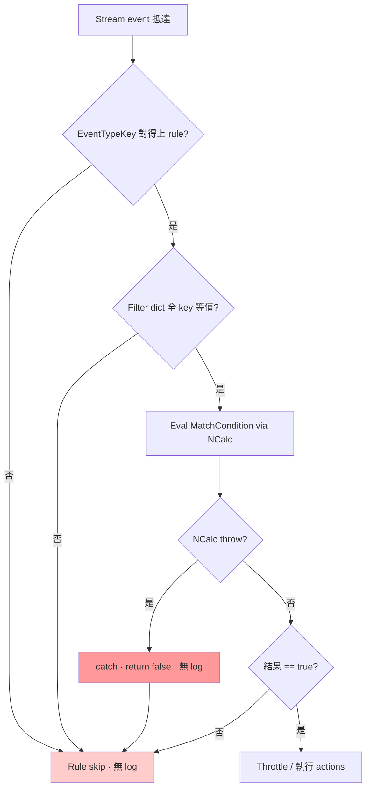
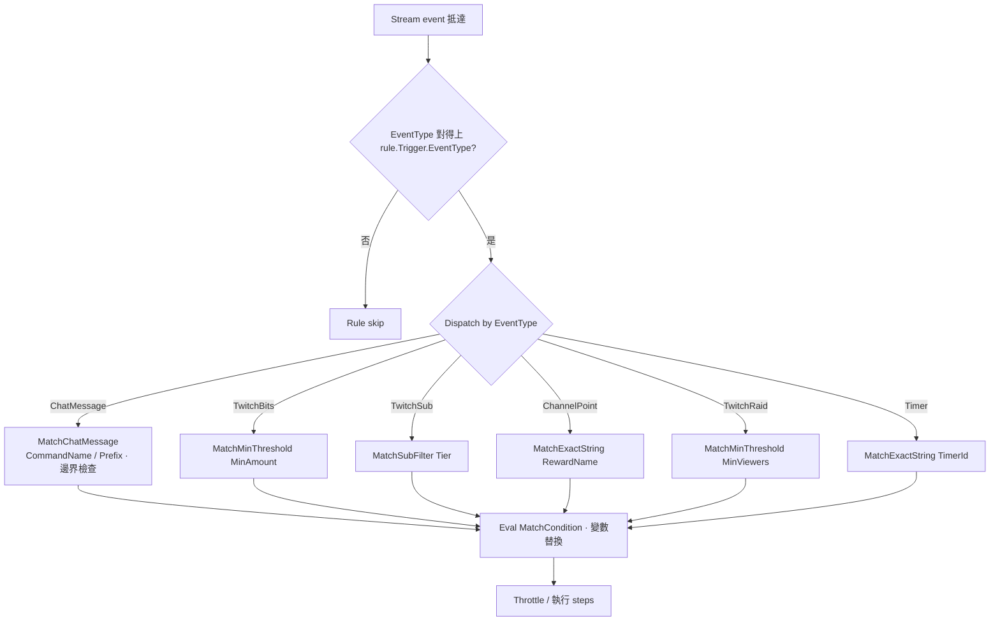
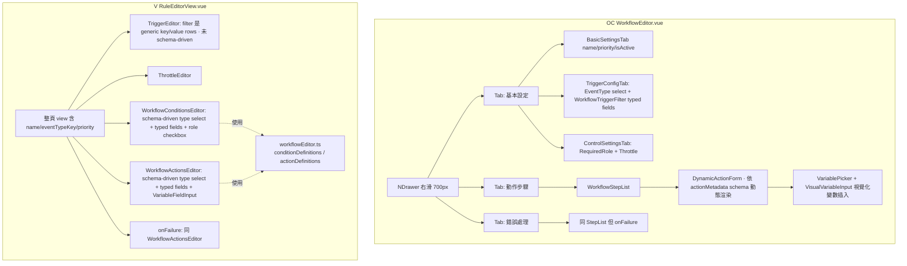

# 工作流規則設計比較與遷移計畫

> **狀態**: Draft · **作者**: Codex · **建立日**: 2026-05-27
>
> **對照基準**: `ref/Omni-Commander` (OC) vs `src/Vulperonex.*` (V) 現況
>
> **動機**: Member overlay 在 Twitch chat 輸入 `!checkin` 無反應，追根究柢發現
> 是現行 trigger filter 設計缺乏 typed semantic 導致誤設 `platform=simulation`
> 鎖死正式平台，且 NCalc 評估失敗會 silent fallback 為 false，整條管線無任何
> 警示。本文整理兩邊設計差異並提出分階段遷移計畫。

---

## 1. 背景：今天的事故

DB 內既有一條 boot-seed 的 Phase 7 sample rule：trigger 為 `user.message`、
`MatchCondition` 比對 `!checkin`、**filter 誤設 `platform=simulation`**，actions
含 `triggerCheckIn` 與 `sendChatMessage`。問題在於 filter 鎖死了 simulation 平台。

問題鏈：

1. 真 Twitch chat 事件 `platform=twitch`，generic filter dispatch
   ([WorkflowEngine.cs:242 `MatchesTriggerFilter`](../../../src/Vulperonex.Application/Workflows/WorkflowEngine.cs))
   要求 dict 內所有 key/value 相等 → `simulation != twitch` → 規則 silent skip。
2. 操作者無法從 UI / log 得知為何沒觸發；DB 內 filter key `platform` 與
   Vulperonex 領域語意（事件型別與 filter 應為「事件 payload 維度」）混淆。
3. NCalc evaluator
   ([NCalcExpressionEvaluator.cs:36](../../../src/Vulperonex.Infrastructure/Expressions/NCalcExpressionEvaluator.cs))
   silent 路徑共三條：`null/whitespace` ([:13](../../../src/Vulperonex.Infrastructure/Expressions/NCalcExpressionEvaluator.cs))、
   `HasErrors()` ([:29](../../../src/Vulperonex.Infrastructure/Expressions/NCalcExpressionEvaluator.cs))、
   `catch { return false; }` ([:36](../../../src/Vulperonex.Infrastructure/Expressions/NCalcExpressionEvaluator.cs))
   全部回 false 不 log → 寫錯 `MatchCondition` 完全靜默。

> **註 (2026-05-28)**：commit `b063d1a feat(web): seed default !checkin chat rule on first boot`
> 已**並聯**新增不帶錯誤 filter 的預設 `!checkin` rule（`DefaultWorkflowRuleSeedService`
> 在 DB 無任何 `triggerCheckIn` 規則時才補種）。
>
> **開發階段決策 (2026-05-28)**：Vulperonex 尚未釋出，無真實 operator 資料。Phase B
> **直接 wipe 既有 workflow rules + reseed typed 範例**，不走 `legacy_filter_blob`
> audit 路徑（撤回先前 AD-5）。本文聚焦**系統性**修復（typed dispatch + 失敗
> 可觀測性 + 範例重建），非該單一 bug 的 hotfix。

對照 OC：`TriggerMatcher.cs` 依 `EventType` 走 typed switch dispatch，
`ChatMessage` 自動處理「指令邊界 (`!so` 不誤匹 `!sorry`)」、`TwitchSub`
有 `Tier` 專屬欄位、`TwitchBits` 有 `MinAmount` 門檻比較等。
filter key 不是 user 自由填寫，是引擎針對事件型別開的固定槽位。

---

## 2. Domain Schema 比較

| 維度 | OC (ref) | V (現) | 評析 |
|---|---|---|---|
| Event type | `enum TriggerEventType`（9 個 typed） | `string EventTypeKey`（open） | OC 編譯時期保證；V 擴充無需改 enum |
| Trigger 結構 | `WorkflowTrigger { EventType, Filter, MatchCondition }` | `WorkflowTrigger { EventTypeKey, Filter, MatchCondition }` | 同 |
| Filter 語意 | per-event-type typed semantics（`CommandName`/`Prefix`/`MinViewers`/`Tier`／`RewardName`） | generic `Dict<string,string>` 全 key 等值 | **OC 勝**；V 易誤用 |
| Action 模型 | `WorkflowStep { ActionName: string, Parameters: Dict<string,string> }` | `WorkflowAction` 抽象 + `[JsonPolymorphic]` 強型別 record（15 種，[Actions/](../../../src/Vulperonex.Application/Workflows/Actions/)） | **V 勝**；type-safe + IDE 補完 |
| Sub-workflow | `Trigger == null` 隱式 | `IsSubWorkflow: bool` 顯式 + `InvokeSubWorkflowAction` | V 較清楚 |
| Throttle | `ThrottlePolicy` | `WorkflowThrottlePolicy` | 一致 |
| 權限 | `RequiredRole`（CommandRoleLevel）+ `RequiredCustomRoles` first-class | 無（要塞進 `Conditions[]` 或 `MatchCondition`） | **OC 勝** |
| Conditions | 無獨立層（全靠 `MatchCondition`） | `Conditions[]` + `MatchCondition`（雙層） | V 多層可能多餘 |
| Execution mode | 序列固定 | `Serial` / `Parallel` + `MaxParallelism` | V 多功能 |
| 表示式引擎 | 自家 ExpressionEvaluator（簡單變數替換） | NCalc 全表示式 | V 表達力強；OC 簡單可預測 |
| 變數 namespace | `Trigger.*` / `Step.*` / `Args.*` | + `Member.*` / `Failure.*` | V 多 |

---

## 3. Trigger 匹配流程圖

### 3.1 V 現況（generic dispatch）

**Silent failure 點**：B / C / E / F 全部不發 log，今天的事故踩在 C（filter
`platform=simulation` 拒絕 Twitch 事件）。

### 3.2 OC（typed dispatch）

**差異**：每個 event type 的 filter 語意由引擎決定，user 不會誤填出無效
filter。`MatchChatMessage` 自動加邊界檢查防 `!so` 誤匹 `!sorry`，這是 V
完全沒有的安全網。

---

## 4. UI/UX 比較

### 4.1 技術棧

| | OC | V |
|---|---|---|
| Framework | Vue 3 + Naive UI + Tailwind + Vite + **Tauri** | Vue 3 + 自家 CSS + Vite |
| Component library | Naive UI（完整 design system） | 自家 components |

### 4.2 編輯器結構

**V 已實作 schema-driven 視覺化編輯器**，包含型別選擇下拉選單、強型別欄位渲染（支援 text、number、textarea、checkbox、select、string-list、number-list）、角色權限 checkbox UI，以及 `VariablePicker` 與 `VariableFieldInput` 變數插入功能。`actionsText` 與 `conditionsText` 僅作為父子元件間的序列化傳輸字串，並非使用者實際的編輯介面。

| 維度 | OC | V | 評析 |
|---|---|---|---|
| 容器 | Drawer（不離開 list） | 整頁 view（切頁失 context） | OC 流暢 |
| 分區 | Tabs（基本/動作/失敗） | 縱向長 form | OC 分區清楚 |
| Trigger filter | 依 event type 動態切換 typed 欄位 | generic key/value 空白填寫 | **OC 勝**（V 唯一未 schema-driven 區塊） |
| Action 編輯 | `DynamicActionForm` schema-driven | `WorkflowActionsEditor` 已 schema-driven | **打平** |
| Condition 編輯 | （經 `WorkflowStepList`） | `WorkflowConditionsEditor` schema-driven + role checkbox | **打平** |
| 變數插入 | `VariablePicker` + `VisualVariableInput`（OC node view） | `VariablePicker` + `VariableFieldInput`（V，cursor-aware 插入） | **打平** |
| Metadata 來源 | 後端 `TriggerMetadataProvider` / Action metadata（單一事實） | 前端 `workflowEditor.ts` 內 hardcode | OC 勝 — V metadata 在 FE 與 BE schema 雙寫風險 |
| 驗證錯誤 | 解析後端 `WorkflowValidationResult.errors[].code/message` 結構化呈現 | 字串 detail | OC 較細 |

### 4.3 Metadata-driven 設計

OC 後端有 `TriggerMetadataProvider` 提供：
- `GetAvailableTriggers()`：可選的 event type 列表
- `GetValidVariables()`：每個 event type 合法的 `{Trigger.*}` 變數白名單
  （e.g. `ChatMessage` 有 `CommandName`/`RawMessage`/`UserLogin`/...）

前端 store 從後端拉 metadata，UI 渲染時依此：
- Trigger 下拉只列合法 event type
- Filter 欄位依 event type 切換 typed schema
- `VariablePicker` 只列當前 event type 合法的變數
- Action form 由 `getActionMetadata(actionName)` 拿 parameter schema 渲染

**V 現況**：
- Action / Condition metadata 已存在但在**前端** `workflowEditor.ts`（hardcode
  `actionDefinitions` / `conditionDefinitions`）。
- Trigger filter 仍 generic key/value，**未 schema-driven**。
- 後端 `WorkflowRuleValidator` 已有部分驗證（event type known check）但
  不暴露 metadata 給前端。

**核心 Gap 分析**：
1. Trigger filter 未 schema-driven — 唯一硬傷
2. metadata 在 FE / BE 雙寫風險 — 加 action 要動 FE TypeScript + BE record，
   無單一事實來源
3. 變數白名單未 per-event-type 限制 — `VariablePicker` 列所有變數而非依
   當前 trigger 過濾

---

## 5. 客觀總結

**Vulperonex 勝項保留**：
1. **Schema-driven 編輯器 UI**：已實作強型別 `WorkflowConditionsEditor`/`WorkflowActionsEditor`/`VariableFieldInput`。
2. **Action 強型別設計**：使用 polymorphic record（`[JsonPolymorphic]`），確保執行期（runtime）型別安全。
3. **NCalc 表示式引擎**：支援任意布林邏輯評估，表達力強。
4. **顯式設計**：清晰的 `IsSubWorkflow` 顯式聲明與 `Parallel` 執行模式。
5. **事件擴充彈性**：`EventTypeKey` 採 open string 設計，新增事件無需修改後端 Enum。
6. **角色權限過濾**：已具備強型別 `UserRoleCondition` 與前端角色勾選 UI。

**Omni-Commander 借鏡與改進項**：
1. **Trigger Filter 強型別語意（Per Event Type）**：改進 generic dict 的全等比對，杜絕平台欄位誤設導致的靜默跳過。
2. **後端 Metadata Provider 作為單一事實**：取代目前前端 `workflowEditor.ts` 的 hardcode，用以驅動前端 Filter 欄位 Schema 與動態變數白名單。
3. **Drawer + Tabs 容器 UX**：改善 V 現行整頁 Form 導致切頁遺失上下文的問題。
4. **NCalc 評估異常日誌定位**：將 NCalc catch 全吞例外的行為改為 `LogWarning`，並注入規則識別子以利排障。

---

## 5b. V 自身的 schema 內部衝突（與 OC 對照無關）

跨檔靜態分析揭示下列既有設計矛盾，需在跨平台借鏡之前先收拾乾淨。
否則 Phase B 的 metadata UI 一上線，這些矛盾會直接放大成 UX bug。

### 5b.1 `EventTypeKey` 雙重定義

- 外層：[`WorkflowRule.EventTypeKey`](../../../src/Vulperonex.Application/Workflows/WorkflowRule.cs)（`required string`）
- 內層：[`WorkflowTrigger.EventTypeKey`](../../../src/Vulperonex.Application/Workflows/WorkflowTrigger.cs)
- 路由：[`WorkflowEngine.ProcessEventAsync`](../../../src/Vulperonex.Application/Workflows/WorkflowEngine.cs) 用外層

**已有的防線**（修正先前評估）：
- API 入口：[`WorkflowRuleValidator.cs:54`](../../../src/Hosts/Vulperonex.Web/Validation/WorkflowRuleValidator.cs) 直接拒絕外/內 `EventTypeKey` 不一致的 upsert
- JSON 反序列化：[`WorkflowRuleJsonMapper.NormalizeTrigger`](../../../src/Hosts/Vulperonex.Web/Workflows/WorkflowRuleJsonMapper.cs) 強制內層 = 外層

**殘留風險**：API/UI 路徑已守住，但下列入口仍可能寫入冗餘 / 過時資料：
- DB 直接 INSERT / UPDATE（migration 腳本、手動修庫）
- CLI / plugin 不經 Web validator 直接呼叫 `IWorkflowRuleRepository`
- 歷史既有 rule（在 validator 補完前寫入的資料）

問題本質是**結構冗餘**：兩處欄位被人為保持同步、前端必須雙寫，後續每個
新入口都得記得補一遍。

**處置**：廢除 `WorkflowTrigger.EventTypeKey`，外層為單一事實。
Phase A.5 重點是 **schema 簡化 + legacy row migration**（不是補 validator
缺口）。前端編輯器移除雙寫；CLI / plugin 自動受惠（少一個容易遺漏的欄位）。

### 5b.2 `MatchCondition` 雙重定義 + fallback 順序

- 外層：`WorkflowRule.MatchCondition`
- 內層：`WorkflowTrigger.MatchCondition`
- Engine：`var matchCondition = rule.MatchCondition ?? trigger?.MatchCondition;`

問題：語意模糊（外層空字串 vs null 行為差異）；前端必須雙向同步；
`WorkflowRule.Conditions[]` 已是獨立層，再多兩個 MatchCondition 共三層
邏輯閘，operator 無法直覺推理。

**處置**：保留外層 `WorkflowRule.MatchCondition` + `Conditions[]`，
廢除 `WorkflowTrigger.MatchCondition`。MatchCondition 是「跨 trigger 的
規則層守衛」，與 trigger 結構無關，外層才是正確歸屬。

### 5b.3 `IsSubWorkflow == true` 與 `required EventTypeKey` 衝突

- `WorkflowRule.EventTypeKey` 是 `required string`
- `WorkflowRule.IsSubWorkflow == true` 時引擎跳過 event 路由
- 前端 `isSubWorkflow=true` 隱藏 `TriggerEditor`，送出時 `eventTypeKey=""`
- 「用空字串繞過 required」與強型別精神衝突

問題：Phase B metadata 驗證一旦上線（`eventTypeKey` 必須在合法清單內），
空字串會被擋下。

**現況實測**：`WorkflowRuleValidator` 完全沒有 `IsSubWorkflow` 分支，§5b.6
之 null/whitespace short-circuit 對 sub-workflow upsert 同樣生效 → 今日
經 API 建 sub-workflow rule **已 broken**（回 400 `UNKNOWN_EVENT_TYPE_KEY`）。

**既有寫入路徑**：[`DefaultWorkflowRuleSeedService`](../../../src/Hosts/Vulperonex.Web/DefaultWorkflowRuleSeedService.cs)
透過 `IWorkflowRuleRepository` 直寫繞過 validator（合理 — seed 屬 internal
trust boundary）。Web API 路徑無法建 sub-workflow rule，需 Phase A.5
validator 增 `IsSubWorkflow` 分支同時解鎖。

**處置**：`WorkflowRule.EventTypeKey` 改 `string?`。Validator：
`IsSubWorkflow == true` 時必須為 null 且 `Trigger == null`；
`IsSubWorkflow == false` 時必須非空且在 metadata 合法清單內。
DB migration：把既有 sub-workflow rule 的 `eventTypeKey=""` 改成 NULL。

### 5b.4 `ExpressionContext` 缺 RuleId/RuleName — Log 無法定位

[`ExpressionContext`](../../../src/Vulperonex.Application/Expressions/ExpressionContext.cs)
只攜帶 `Trigger`/`Steps`/`Args`/`Member`/`Failure`。NCalc evaluator catch
吞例外時只知道 expression 字串，不知是哪條 rule。Phase A
「operator 看得到失敗原因」目標會因此打折。

**處置**：兩條路擇一
- (a) `ExpressionContext` 加 `RuleId` / `RuleName` 屬性，建構時填入；或
- (b) 改 `IExpressionEvaluator.Evaluate` 簽名加 `EvaluationCallSite { RuleId, RuleName, Stage }` 參數

(a) 改動最小但污染 context；(b) 較乾淨但 breaking API。傾向 (a)，
context 本就是「給 evaluator 看的所有狀態」。

### 5b.5 `workflow.timer` 未註冊到 event type registry — UI / Validator 雙缺

[`StreamEventKeys.cs`](../../../src/Vulperonex.Domain/Events/StreamEventKeys.cs)
定義 `WorkflowTimer = "workflow.timer"`，且
[`WorkflowTimerHostedService`](../../../src/Vulperonex.Application/Workflows/Timers/WorkflowTimerHostedService.cs)
會以此 key 發出 `WorkflowSystemEvent`，但：

- **UI dropdown 真正來源**是
  [`/api/event-types`](../../../src/Hosts/Vulperonex.Web/Endpoints/EventTypeEndpoints.cs)
  → `IStreamEventTypeRegistry.GetAll()`，回傳的是
  [`InMemoryStreamEventTypeRegistry`](../../../src/Vulperonex.Infrastructure/EventTypes/InMemoryStreamEventTypeRegistry.cs)
  中**已透過 `Register()` 註冊**的 metadata。
- 目前 registry 只在 adapter `StartAsync` 註冊各自支援的 event；
  [`TwitchAdapter.cs:21-31`](../../../src/Adapters/Vulperonex.Adapters.Twitch/TwitchAdapter.cs)
  與 simulation adapter 都沒有列入 `workflow.timer`（合理 — timer 是
  engine-internal 事件，非 adapter-sourced）。
- 結果：operator 在 UI 看不到 timer 選項；即便直接 `POST /api/rules`
  傳 `eventTypeKey="workflow.timer"`，
  [`WorkflowRuleValidator.cs:24`](../../../src/Hosts/Vulperonex.Web/Validation/WorkflowRuleValidator.cs)
  之 `IsKnownForWorkflow("workflow.timer")` 回 false → 400。

**注意**：[`StreamEventDescriptions.cs`](../../../src/Vulperonex.Domain/Events/StreamEventDescriptions.cs)
也漏 `WorkflowTimer` entry，但該 class 在 `src/` 內無任何呼叫（僅測試使用），
**修它不會解決 UI / validator 問題**。先前評估誤將其視為單點修復；
真正修復需動 registry bootstrap。

**處置**：在 engine-internal 事件 bootstrap 註冊 `workflow.timer`。
兩個落點擇一：
- (a) 新增 `WorkflowInternalEventTypeBootstrapper` 一次性 `IHostedService`，
  在 `StartAsync` 把 engine-emitted key 註冊到 registry（與 adapter 對稱）。
  優：架構乾淨，未來加 engine-internal event 同處新增即可。
- (b) 覆寫 `WorkflowTimerHostedService.StartAsync` 在啟動前註冊。
  優：改動最小。劣：職責混雜（loop service 兼註冊器）。

**決議：採 (a)**（採納二輪 review 背書）。`StreamEventDescriptions` 同步補
entry 以保持描述表一致性，但不視為「修復」（避免再有人誤以為改它就好）。
未來其他 engine-internal event（如系統警報、狀態變更）一律進此 Bootstrapper。

驗收：
- `curl /api/event-types` 回應含 `{ "key": "workflow.timer", "description": "...", "isSimulatable": false }`
- `POST /api/rules` 帶 `eventTypeKey="workflow.timer"` 不再回 `UnknownEventTypeKey`
- UI dropdown 出現 timer 選項
- 既有 timer 直接呼叫路徑（`InvokeAsync`）行為不變

### 5b.6 `WorkflowRuleValidator` 對 `EventTypeKey=null` 引發 500 而非 400（**已修**）

[`WorkflowRuleValidator.cs:28`](../../../src/Hosts/Vulperonex.Web/Validation/WorkflowRuleValidator.cs)
原先直接呼叫 `eventTypeRegistry.IsKnownForWorkflow(request.EventTypeKey)`，
但 [`WorkflowRuleUpsertRequest`](../../../src/Hosts/Vulperonex.Web/Workflows/WorkflowRuleDto.cs)
之 `EventTypeKey` 雖宣告為 `string`（C# nullable annotation 非 runtime
強制），JSON deserializer 可填入 null（或省略欄位）。

呼叫鏈：
- `IsKnownForWorkflow(null)` →
- [`InMemoryStreamEventTypeRegistry`](../../../src/Vulperonex.Infrastructure/EventTypes/InMemoryStreamEventTypeRegistry.cs)
  之 `_metadataByKey.TryGetValue(null, ...)` →
- `ArgumentNullException` →
- HTTP 500（破壞 API 契約：應為 400 + `UNKNOWN_EVENT_TYPE_KEY`）

**處置**（已於本次提交修正）：
- 在 `Validate` 入口加 `string.IsNullOrWhiteSpace(request.EventTypeKey)` 短路
- 加 integration test `Given_WorkflowRuleCreate_When_EventTypeKeyIsNull_Then_Returns400WithUnknownEventTypeKey`
  防 regression

**註**：§5b.3 之 sub-workflow `EventTypeKey: string?` 設計上線後此 nullable
合法，本短路檢查仍需保留 — 屆時改為「非 sub-workflow 且 EventTypeKey 為
null/whitespace」才 reject。

---

## 6. 遷移計畫（Phase 分解）

### Phase A · 立即止血（不改 schema）

**目標**：今天的 bug 不再 silent，operator 至少看得到失敗原因，且能
定位到具體 rule（解 §5b.4）。

**Log 噪音原則**（每條規則對每個 matching event type 都會 fan-out，
chat 流量下 no-match 是常態路徑，不能用 warning 灌爆檔案）：

| 事件 | 等級 | 理由 |
|---|---|---|
| Expression parse / eval throw | `Warning` | 設定錯誤、低頻、需操作者注意 |
| Filter key 不在 metadata 合法清單 | `Warning` | 設定錯誤、需操作者注意 |
| Action executor throw | `Warning` | 真實失敗 |
| Filter key 在清單內但 value 不匹配（正常 no-match） | `Debug` | 高頻常態 |
| `MatchCondition` 評估為 false（正常 no-match） | `Debug` | 高頻常態 |
| Throttle deny | `Debug` | 高頻常態（per-user cooldown） |
| `EventTypeKey` 不匹配（rule 完全不關心此事件） | (不 log) | 屬於正常 fan-out |

**PII / 敏感資料**：log 不寫出完整 expression body 與 filter value 字串；
改記 `RuleId` + `ExpressionHash`（SHA1 前 8 碼）+ 分類碼。除錯時 operator
可用 `RuleId` 反查 DB 原始 expression。

**任務**：
- [ ] `ExpressionContext` 加 `RuleId` / `RuleName` 屬性（解 §5b.4）
- [ ] `WorkflowEngine.BuildExpressionContext` 帶入當前 rule 資料
- [ ] `NCalcExpressionEvaluator` 注入 `ILogger`
  - eval throw / `HasErrors` → `LogWarning` 含 `{RuleId} {RuleName} {ExpressionHash} {ErrorClass}`
- [ ] `WorkflowEngine` 注入 `ILogger`，依上表分級
  - 引入 structured event log（`workflow_rule_skipped` + 分類欄位）讓
    operator 能以查詢方式 aggregate，而不是依賴 free-text grep
- [ ] `MatchesTriggerFilter`：unknown key → `Warning`；value mismatch → `Debug`
- [ ] 文件補一段「filter key 已知合法清單」短表（暫時人工維護，Phase B 取代）

**驗收**：
- 一個刻意 typo 的 rule，restart Web → trigger event → `Warning` 顯示
  `RuleId={...} ExpressionHash=... ErrorClass=...` 能直接定位
- 正常聊天流量下，`Information` 預設 log level 看不到 no-match 噪音；
  切到 `Debug` 才看得到完整 fan-out 追蹤
- log 內無完整 expression 文字（避免 PII / secret leak）

### Phase A.5 · Schema 內部清理（解 §5b.1 / §5b.2 / §5b.3）

**目標**：消除 V 自身的 schema 冗餘與矛盾，為 Phase B metadata 鋪平地。

- [ ] **§5b.1**：廢除 `WorkflowTrigger.EventTypeKey`
  - Domain model 移除欄位（保持 JsonConstructor 接受舊欄位 deserialize
    但忽略，避免破壞既有 DB row）
  - DB migration：掃描 `workflow_rules.trigger_json`，把內層
    `eventTypeKey` 移到外層（若兩者不一致，外層優先 + warning log）
  - 前端 `RuleEditorView` 移除雙寫；trigger 編輯器只讀外層
- [ ] **§5b.2**：廢除 `WorkflowTrigger.MatchCondition`
  - Domain model 移除欄位
  - DB migration：若內層有值且外層為 null，搬到外層；兩者皆有則外層
    優先 + warning
  - `WorkflowEngine.MatchesTrigger` 移除 fallback，只看 `rule.MatchCondition`
- [ ] **§5b.3**：`WorkflowRule.EventTypeKey` 改 `string?`（**任務順序固定**，BE 先 FE 後）
  - [1] Validator (`WorkflowRuleValidator`)：
    - `IsSubWorkflow == true` ⇒ `EventTypeKey is null && Trigger is null`
    - `IsSubWorkflow == false` ⇒ `EventTypeKey is not null and not whitespace`
  - [2] DB migration：sub-workflow rule 之 `event_type_key = ''` 改 NULL
    - **預檢**：確認 EF Core 實體映射 nullable 與 column constraint 同步調整
    - **鎖表風險**：先在 staging 跑 `EXPLAIN`（或 SQLite `EXPLAIN QUERY PLAN`）
      評估資料量；若需 ALTER COLUMN 改 NULL，分兩 migration（先 drop NOT NULL，
      後續釋出再 backfill）避免長鎖
  - [3] 前端（[1] 上線後）：sub-workflow 模式時送出 payload 直接 omit `eventTypeKey`

**驗收**：
- `EventTypeKey` 在 schema 中只出現一次
- `MatchCondition` 在 schema 中只出現一次（與 `Conditions[]` 並列）
- 新建 sub-workflow rule 不需要填 trigger，validator 不抱怨
- 既有 rule 全部正常 round-trip（read → edit → save）不丟欄位

### Phase B · Metadata 服務層

**目標**：後端有單一事實來源，告訴前端「每個 event type 合法的 filter
欄位、變數、action 參數」。

**開發階段政策（取代先前 legacy_filter_blob 設計）**：

V 尚未釋出，無真實 operator 資料 → 走最簡路徑：

| 路徑 | 政策 |
|---|---|
| **新建/編輯 rule** | **strict** — 不在 metadata 合法清單內的 filter key 直接 400 |
| **既有 rule 讀取** | **strict** — 不再有 lenient 路徑，因 DB 已被 wipe |
| **Engine runtime 路由** | 只 evaluate `Trigger.Filter`（typed matcher 從 Phase C 上線） |
| **DB Migration（Phase B 出貨）** | `DELETE FROM workflow_rules` 全清（dev 階段安全），由 `DefaultWorkflowRuleSeedService` reseed 一組 typed 範例 rule 重新建立基準 |

**任務**：
- [ ] 新增 `ITriggerMetadataProvider`（仿 OC），回傳：
  - `AvailableEventTypes`: `[{ key, displayName, description }]`
  - `FilterFieldsFor(eventTypeKey)`: `[{ key, label, type: text/number/select, options?, help, required? }]`
  - `ValidVariablesFor(eventTypeKey)`: `string[]`
- [ ] 新增 `IActionMetadataProvider`：每個 action 宣告
  `parameters: [{ key, displayName, type, isRequired, description, defaultValue }]`
  - 由 action record 自帶 attribute 或 builder pattern 寫
- [ ] 加 endpoint `GET /api/metadata/triggers` / `GET /api/metadata/actions`
- [ ] 加 endpoint `GET /api/rules?withMigrationWarnings=true` 讓 UI 能標記
      待處理 rule
- [ ] `WorkflowRuleValidator`：新建/編輯路徑採 strict；讀取路徑 lenient
- [ ] DB Migration：legacy filter key 搬到 `legacy_filter_blob` 並標記
- [ ] 單元測試：每個現有 EventTypeKey 在 metadata 內有對應 entry；
      strict validator 對未在 metadata 內的 filter key 回 400；
      lenient 讀取保留並回 `migrationWarnings`

**驗收**：
- 新 rule 無法寫入非法 filter key（API 直接 400）
- 既有違規 rule 仍可讀，回應內含 `migrationWarnings: ["filter.platform 已棄用"]`
- 前端 list 在違規 rule 上顯示警告 chip；點 edit 進入編輯器強制 operator
  處理後才能存檔
- 不存在「既有 rule 全部通過 strict validator」的宣告；改成「全部 round-trip
  讀取成功 + 違規 rule 帶 warning」

### Phase C · Filter typed dispatch（後端）

**目標**：把 generic dict 比對換成 OC 風格的 per-event-type matcher。

**前置**：Phase A.5（schema 清理）+ Phase B（metadata + legacy migration）
已完成。Legacy migration 已把違規 filter key 搬到 `legacy_filter_blob`
（見 Phase B 政策表）。

- [ ] 新增 `TriggerFilterMatcherRegistry` 依 EventTypeKey 註冊 matcher
- [ ] 內建 matcher（event key 對齊 [`StreamEventKeys.cs`](../../../src/Vulperonex.Domain/Events/StreamEventKeys.cs)）：
  - `user.message` → `MatchChatMessage`（CommandName / Prefix + 邊界檢查）
  - `user.donated` → `MatchMinThreshold(MinAmount)`
  - `user.subscribed` → `MatchSubFilter(Tier)`
  - `user.gifted_sub` → `MatchSubFilter(Tier) + MatchMinThreshold(MinGiftCount)`
  - `channel.raided` → `MatchMinThreshold(MinViewers)`
  - `reward.redeemed` → `MatchExactString(RewardName)`
  - `workflow.timer` → `MatchExactString(TimerId)`
  - 其他 → fallback generic dict + warn log（向後相容窗口期）
- [ ] `WorkflowEngine.MatchesTrigger` 改呼 matcher registry
- [ ] **`legacy_filter_blob` 不參與 matcher registry**（Phase B 政策已強制
      其純 UI/audit 用途）；engine 看到的 `Trigger.Filter` 已是 migration
      清乾淨的版本
- [ ] 加單元 / 整合測試：`!so` 不匹 `!sorry`、`MinAmount: 100` 不匹
      `Bits=50`
- [ ] 整合測試：`§1` sample rule 在 Phase B 遷移後（platform=simulation
      已從 `Trigger.Filter` 移到 `legacy_filter_blob`）於 Twitch chat
      `!checkin` 觸發成功

**驗收**：
- **§1 原 rule**（Id 對應 boot-seed 前手動建立、含 `filter.platform=simulation`
  者）經 Phase B migration 後從 Twitch chat 送 `!checkin` 觸發 `triggerCheckIn`
  action（end-to-end）— 排除「boot-seed 並聯新規則」帶來的偽通過
- 既有違規 rule 在 UI 上仍顯示 warning chip 直到 operator 確認從
  `legacy_filter_blob` 清掉；runtime 不會被 blob 內容影響
- 註：本階段不要求「operator 手動刪除 filter.platform=simulation」；
  Phase B migration 已把該欄位從 runtime filter 隔離至 blob，UI 引導
  後續清理

### Phase D · WebUI UX 強化

**核心任務**（基於 Vulperonex 既有 Schema-driven 編輯器進行 UX 升級）：
1. **容器重構**：使用 **Drawer + Tabs 容器**取代整頁 `RuleEditorView`，提升編輯流暢度。
2. **Trigger 編輯器升級**：將 `TriggerEditor` 改為 Schema-driven（與 Phase B 後端 Metadata 串接，消除最後一個 generic 編輯區塊）。
3. **變數選取過濾**：`VariablePicker` 改為依當前事件型別（per-event-type）過濾，僅列出合法的變數白名單。
4. **單一事實拉取**：Action 與 Condition 的定義來源由前端 hardcode 改為從後端 API 統一拉取，杜絕前後端雙寫風險。

**Gate（必須先完成才開工）**：
- 待決策 §8.1（Naive UI vs 手刻）已決議並落定 ADR
- bundle size 影響評估完成（before/after gzip 數字，目標 +< 200 KB）
  - **超出預算之 fallback 順序**：手刻 Drawer/Tabs ＞ Headless UI（Radix Vue
    / PrimeVue 輕量模式）＞ Naive UI tree-shake 後仍超標則放棄整套引入
- 與既有 design token / CSS 變數整合方案敲定
- 未經此 gate 不准 `pnpm add naive-ui` 或同等套件
- Phase B metadata endpoint 已上線（D 依賴 B）

**任務**：
- [ ] 引入 Drawer 容器與 Tabs（library 由 gate 決定）
- [ ] 新 `RuleEditorDrawer.vue` 取代整頁 `RuleEditorView.vue`
  - 三 tab：基本 / 動作步驟（embed 既有 `WorkflowActionsEditor`） /
    錯誤處理（embed 既有 onFailure editor）
- [ ] `TriggerEditor` 改 schema-driven：拉 `/api/metadata/triggers`
  `FilterFieldsFor(eventTypeKey)`，依 schema 動態渲染 typed 欄位
  （取代現行 generic key/value rows）
- [ ] `VariablePicker` 改為依當前 `eventTypeKey` 從 metadata 拉
  `ValidVariablesFor(eventTypeKey)` 過濾顯示
- [ ] 既有 `workflowEditor.ts` 內 hardcode `actionDefinitions` /
  `conditionDefinitions` 改為從 `/api/metadata/actions` 拉，保留 fallback
- [ ] 既有 `RuleEditorView` 保留為 "Advanced JSON Mode" fallback
- [ ] 漸進遷移：list 加「Edit (New)」按鈕，舊按鈕保留

**驗收**：
- streamer 在新 Drawer 內無需 JSON 即可建出 §1 sample rule
- `TriggerEditor` 在 `user.message` 下出現 `CommandName` / `Prefix` typed 欄位
- `VariablePicker` 在 `user.message` 下僅列該 event 合法變數
- 加新 action 只需動 BE record + metadata attribute，FE 自動拉取無需改

### Phase E · 角色 gating UX 強化

**核心任務**（沿用 Vulperonex 既有強型別 `UserRoleCondition`，避免頂層冗餘過濾）：
- 沿用既有 Condition 執行路徑，專注於前端編輯器之 UX 易用性強化。

**任務**：
- [ ] Editor 在基本設定 tab 加「常用角色限制」捷徑（背後直接 push 一個
      `userRole` Condition 到 `Conditions[]`，避免 operator 為每條 rule
      手動加 Condition）
- [ ] Conditions tab UI 把 `userRole` Condition 視覺化在最上方（已知最常用）
- [ ] Migration 提示：掃描既有 rule 含 `Member.IsModerator` /
      `Member.IsSubscriber` 等 NCalc 表示式，UI 顯示「可改用
      UserRoleCondition」chip（不自動轉）
- [ ] 文件補一段 NCalc role 表示式 → `UserRoleCondition` 對照範例

**非目標**：
- 不在 `WorkflowRule` 頂層加 `RequiredRole` / `RequiredCustomRoles` 欄位
- 不改 `UserRoleCondition` 行為或 schema

**驗收**：
- Editor 基本 tab 有 role chip 快捷區，勾選即新增 `userRole` Condition
- 既有用 NCalc 寫 role 邏輯的 rule，UI 提示改用 Condition 但不自動轉

---

## 7. 風險與非目標

**風險**：
- Phase A.5 schema migration 失敗 → 既有 rule 讀取錯亂。對策：
  migration 在獨立 transaction，含 dry-run mode；每條 rule 改寫前後
  做 JSON diff log；保留 backup table 一個 release cycle
- Phase A.5 廢除內層欄位破壞既有 API 用戶端（CLI / plugin）→ 對策：
  JsonConstructor 仍接收舊欄位但忽略並 warn；release notes 標 breaking
- Phase C 改 matcher dispatch 可能 break 既有 rule（user 之前靠 generic
  filter 達成某些奇技淫巧）→ 對策：fallback generic 比對 + warning log
- Phase D 引入 Naive UI 增加 bundle size → 對策：tree-shake 評估，必要時
  手刻同等元件
- Metadata schema 一旦釋出，後續加 action / event 必須同步 metadata →
  測試守住

**非目標**：
- 不重寫 NCalc 引擎（保留 V 強表達力）
- 不替換 action polymorphic record（V 該勝項保留）
- 不從 OC 移植 desktop (Tauri) — V 是 web-first
- 不完全復刻 OC UI，僅借鏡 UX pattern

---

## 8. 決策紀錄

1. **已決（2026-05-28）**：Phase D 容器庫採 **Reka UI**（前身 Radix Vue，
   headless primitives）+ V 既有自家 CSS。理由：bundle 最小（預估 +~30 KB gzip
   遠低於 200 KB 預算）、a11y 業界最佳（WAI-ARIA 全套）、與 V「自家 CSS」
   哲學零衝突、不綁 Tailwind。
   **Fallback 順序**（PoC bundle 超標或整合失敗時）：Naive UI tree-shake
   ＞ 純手刻。Phase D Gate 須先 PoC 確認 Drawer + Tabs + Form primitives
   bundle 數字後落 ADR。
2. **已決（採二輪 review 背書）**：metadata 來源**放後端**，由 action record
   自帶 attribute、provider 反射產生。理由：單一事實來源，杜絕雙寫；
   每改一個 action 動兩處的成本以 attribute 共置降到最低。
3. **已決（2026-05-28 開發階段）**：Phase E 之前無需向後相容研究 — DB 將於
   Phase B 全清重 seed，既有 NCalc role 表示式 rule 一併消失。Phase E chip
   建議機制僅服務「未來 operator 自行手寫 NCalc 表示式」的場景。
4. **已決（採二輪 review 背書）**：§5b.4 ExpressionContext RuleId 注入採
   **(a) 加屬性於 Context**。理由：context 本就承載 evaluator 所需全部狀態；
   `IExpressionEvaluator` 簽名穩定利於既有測試與外掛程式相容。
5. **已決（採二輪 review 背書）**：Phase A.5 §5b.1/§5b.2/§5b.3 **合併一次
   release** 出貨。共用同次 DB migration window，避免多次跑 migration 與
   資料版本不一致的複合風險。
6. **已決（採二輪 review 背書）**：§5b.5 採 **(a)
   `WorkflowInternalEventTypeBootstrapper` `IHostedService`**。未來其他
   engine-internal event 一律進此 bootstrap，與 adapter 註冊路徑對稱。

---

## 9. 參考檔案索引

V 現況：
- 規則模型：[`src/Vulperonex.Application/Workflows/WorkflowRule.cs`](../../../src/Vulperonex.Application/Workflows/WorkflowRule.cs)
- Trigger：[`src/Vulperonex.Application/Workflows/WorkflowTrigger.cs`](../../../src/Vulperonex.Application/Workflows/WorkflowTrigger.cs)
- Action 抽象：[`src/Vulperonex.Application/Workflows/Actions/WorkflowAction.cs`](../../../src/Vulperonex.Application/Workflows/Actions/WorkflowAction.cs)
- Engine：[`src/Vulperonex.Application/Workflows/WorkflowEngine.cs`](../../../src/Vulperonex.Application/Workflows/WorkflowEngine.cs)
- 表示式：[`src/Vulperonex.Infrastructure/Expressions/NCalcExpressionEvaluator.cs`](../../../src/Vulperonex.Infrastructure/Expressions/NCalcExpressionEvaluator.cs)
- 編輯器：[`src/frontend/src/views/admin/RuleEditorView.vue`](../../../src/frontend/src/views/admin/RuleEditorView.vue)
- TriggerEditor：[`src/frontend/src/components/admin/TriggerEditor.vue`](../../../src/frontend/src/components/admin/TriggerEditor.vue)

OC (ref/)：
- 規則模型：`ref/Omni-Commander/OmniCommander.Domain/Workflows/WorkflowRule.cs`
- Trigger：`ref/Omni-Commander/OmniCommander.Domain/Workflows/WorkflowTrigger.cs`
- EventType enum：`ref/Omni-Commander/OmniCommander.Domain/Workflows/TriggerEventType.cs`
- Trigger matcher：`ref/Omni-Commander/OmniCommander.Application/Workflows/TriggerMatcher.cs`
- Metadata provider：`ref/Omni-Commander/OmniCommander.Application/Workflows/TriggerMetadataProvider.cs`
- Editor：`ref/Omni-Commander/OmniCommander.UI/src/components/workflow/WorkflowEditor.vue`
- Trigger filter UI：`ref/Omni-Commander/OmniCommander.UI/src/components/workflow/WorkflowTriggerFilter.vue`
- Dynamic action form：`ref/Omni-Commander/OmniCommander.UI/src/components/workflow/DynamicActionForm.vue`
